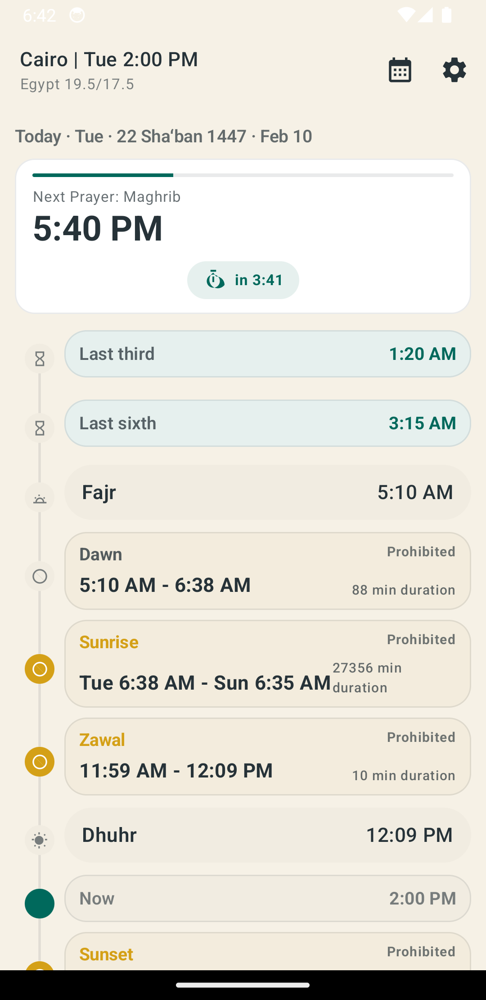
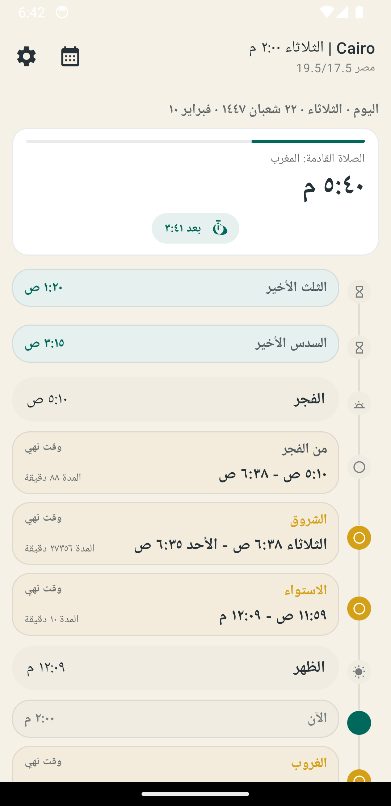
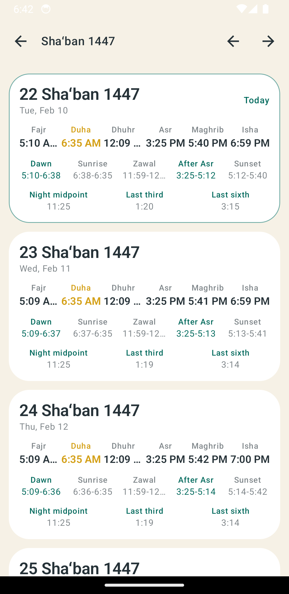
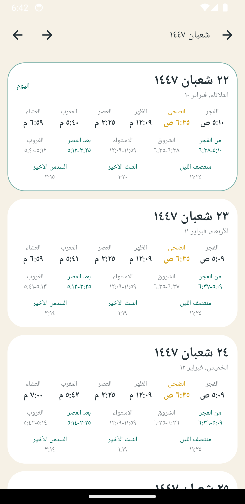
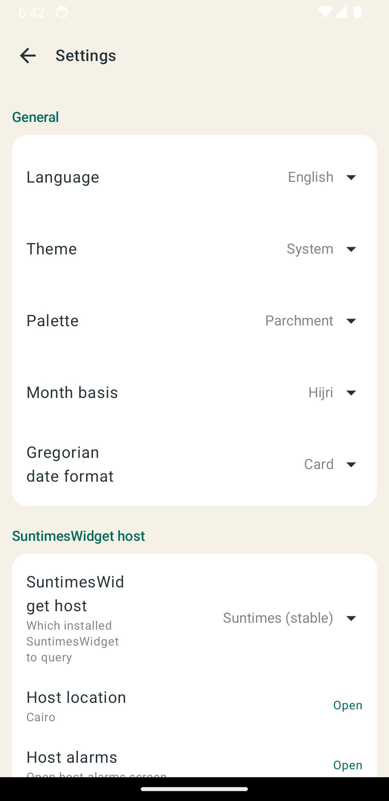
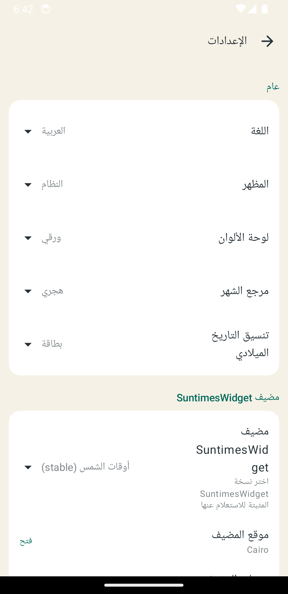

# Suntimes Prayer Times Addon

[](https://developer.android.com/)
[](https://kotlinlang.org/)
[](https://developer.android.com/jetpack/compose)
[](https://m3.material.io/)
[](https://developer.android.com/about/versions/android-6.0)

Prayer times, prohibited (makruh) windows, and night portions as a **SuntimesWidget addon**.

This project intentionally avoids implementing astronomical algorithms: it delegates solar/shadow calculations to the installed **SuntimesWidget** app via its exported `ContentProvider`s.

> Disclaimer: This project was developed with heavy use of AI assistance. Most of the code was generated or edited with OpenAI's Codex 5.3 model.

## Screenshots

<table>
  <thead>
    <tr>
      <th align="left">English</th>
      <th align="left">Arabic (RTL)</th>
    </tr>
  </thead>
  <tbody>
    <tr>
      <td>
        <div><strong>Home</strong> (today timeline)</div>
        
      </td>
      <td>
        <div><strong>Home</strong> (خط اليوم)</div>
        
      </td>
    </tr>
    <tr>
      <td>
        <div><strong>Days</strong> (month cards)</div>
        
      </td>
      <td>
        <div><strong>Days</strong> (بطاقات الشهر)</div>
        
      </td>
    </tr>
    <tr>
      <td>
        <div><strong>Settings</strong> (Material 3)</div>
        
      </td>
      <td>
        <div><strong>Settings</strong> (الإعدادات)</div>
        
      </td>
    </tr>
  </tbody>
</table>

## What This App Does

- Shows a timeline on Home with infinite left/right day paging and a month/day-card list (Days/Calendar).
- Exposes events to **SuntimesWidget Alarms**:
  - prayers (Fajr, Duha, Dhuhr/Jumu'ah, Asr, Maghrib, Isha)
  - prohibited (makruh) boundaries and windows
  - night portions (midpoint, last third, last sixth)
- Tap a prayer/night item on Home to open the host alarm editor prefilled for that event (event-based alarms automatically track changing prayer times; offsets like +/-30m are supported by the host UI).
- Uses distinct makruh levels in UI (light: dawn/after-asr, heavy: sunrise/zawal/sunset) across timeline, calendar cards, and widget labels.
- Provides an Android home-screen widget ("Prayer Times (Today)") with the same day-card model.
- Supports English + Arabic and RTL.
- Supports theme mode (System/Light/Dark) + palette selection:
  - Parchment / Sapphire / Rose
  - Dynamic colors on Android 12+ (Compose + widget backgrounds/accent)

## Requirements

- Android `minSdk 23` (Marshmallow)
- **SuntimesWidget installed** (stable/nightly/legacy supported)
- Host permissions granted (SuntimesWidget protects its providers with `suntimes.*.permission.*`)

## Architecture (Host Delegation)

The app is split into:
- `core/*`: host discovery, provider contracts, event-id mapping, and small derived calculations (night portions, Hijri date)
- `provider/*`: addon `ContentProvider` implementation for SuntimesWidget integration
- `ui/*` and `ui/compose/*`: Compose UI (Home/Days/Settings/Event Picker)
- `widget/*`: RemoteViews widget and update scheduling

### Data Flow

```
            +-------------------+
            |  SuntimesWidget   |
            |-------------------|
            | event.provider    |  content://<host>.event.provider/eventCalc/<eventId>
            | calculator.provider| content://<host>.calculator.provider/sun/<millis>
            +---------^---------+
                      |
                      |  queries (delegation)
                      |
+---------------------+----------------------+
|         PrayerTimesAddon (this app)       |
|-------------------------------------------|
| UI (Compose)                              |
|  - Home/Days/Settings/EventPicker         |
|  - mostly queries host providers directly |
|                                           |
| Addon Provider (exported)                 |
|  - content://...event.provider/eventCalc  |
|  - used by SuntimesWidget alarms          |
|  - also used by widget for eventCalc      |
|                                           |
| Widget (RemoteViews)                      |
|  - reads prefs + provider results         |
+-------------------------------------------+
```

### “No Reinvention” Policy

We treat the host app as the source of truth for all solar/shadow events:
- Prayer times are resolved by translating settings into **host event ids** and asking the host to compute `eventCalc/<eventId>`.
- Calculator provider is used for "bulk" sun times (noon/sunrise/sunset) to reduce query volume and to support past-day computations.

The only non-host math intentionally left is a **compatibility fallback** for Asr when the host does not expose a shadow-ratio event:
- It uses host declination + latitude to translate the juristic factor into an equivalent sun-elevation event id, then still delegates the final time lookup back to the host.

## Host Integration (Addon Contracts)

SuntimesWidget discovers addons via an exported Activity with `suntimes.action.ADDON_EVENT` and metadata pointing to a provider URI.

This project provides:
- `AddonRegistrationActivity` (discovery stub)
- `PrayerTimesProvider` (exported) implementing the same event-provider contract SuntimesWidget expects
- `EventPickerActivity` for `suntimes.action.PICK_EVENT`

### Exported Provider

Authority:
- `com.yshalsager.suntimes.prayertimesaddon.event.provider`

Paths:
- `content://.../eventTypes`
- `content://.../eventInfo/<eventId>`
- `content://.../eventCalc/<eventId>`

### Exposed Events

Prayers:
- `PRAYER_FAJR`
- `PRAYER_DUHA`
- `PRAYER_DHUHR` (displayed as **Jumu'ah** on Friday)
- `PRAYER_ASR`
- `PRAYER_MAGHRIB`
- `PRAYER_ISHA`

Night:
- `NIGHT_MIDPOINT`
- `NIGHT_LAST_THIRD`
- `NIGHT_LAST_SIXTH`

Makruh boundaries:
- `MAKRUH_DAWN_START` / `MAKRUH_DAWN_END`
- `MAKRUH_SUNRISE_START` / `MAKRUH_SUNRISE_END`
- `MAKRUH_ZAWAL_START` / `MAKRUH_ZAWAL_END`
- `MAKRUH_AFTER_ASR_START` / `MAKRUH_AFTER_ASR_END`
- `MAKRUH_SUNSET_START` / `MAKRUH_SUNSET_END`

## Settings Model (High-Level)

- Host selection:
  - Auto-detect stable/nightly/legacy installs.
  - Persist the selected event-provider authority.
  - Open the host location picker UI from Settings (so you can choose from the host's saved locations without duplicating a location database in the addon).
  - Open the host alarms screen from Settings.
- Prayer method:
  - Presets + custom
  - Fajr angle
  - Isha mode (angle / fixed minutes)
  - Asr factor (Shafi=1 / Hanafi=2)
  - Maghrib offset
- Makruh:
  - Presets (Shafi/Hanafi) + custom angle + zawal minutes
  - Sunrise prohibited end as fixed minutes after sunrise (`10`/`15`/`20`)
- Hijri:
  - Variant: Umm al-Qura / Diyanet
  - Day offset: -2..+2 (manual correction)
- Calendar:
  - Month basis: Gregorian / Hijri
  - Gregorian date format: Card / Medium / Long
  - Toggle prohibited row
  - Toggle night row
- Widget:
  - Toggle prohibited row
  - Toggle night row
  - Uses separate toggles from Calendar (not shared)
- Alarms & backup:
  - Export a host-importable prayer alarm preset file (includes Duha)
  - Export/import addon settings as JSON backup
- UI:
  - Language: system / English / Arabic
  - Theme mode: system / light / dark
  - Palette: parchment / dynamic (Android 12+) / sapphire / rose

## Widget

Widget name:
- "Prayer Times (Today)"

Notes:
- Widgets use RemoteViews, so theming is applied by setting background resources + text colors at update time.
- Update scheduling is “best effort”: we update on app settings changes and schedule an alarm for the next meaningful boundary (next prayer / prohibited boundary / midnight rollover).

## Tooling

This repo is intended to be built with:
- Gradle Wrapper (`./gradlew`)
- [`mise`](https://mise.jdx.dev/) for tool/version management (optional but recommended)
- Release builds enable R8 shrinking/optimization (`minifyEnabled`, `shrinkResources`, optimized ProGuard rules)
- Release automation is available via GitHub Actions (`.github/workflows/release.yml`) with dry-run, tag/release flow, signed APK validation, and generated release notes

Useful commands:

```bash
# Build debug APK
mise x java -- ./gradlew :app:assembleDebug

# Run unit tests
mise x java -- ./gradlew :app:testDebugUnitTest
```

## Project Layout

```
app/src/main/java/com/yshalsager/suntimes/prayertimesaddon/
  core/        # contracts, mapping, prefs, Hijri, delegation helpers
  provider/    # exported addon provider for SuntimesWidget
  ui/          # Activities + ViewModels
  ui/compose/  # Compose screens and shared components
  widget/      # AppWidgetProvider + update glue
```

## Credits

- **SuntimesWidget** by Forrest Guice (host app and addon APIs):  
  [forrestguice/SuntimesWidget](https://github.com/forrestguice/SuntimesWidget)
- Time4J (Hijri calendar variants):  
  [MenoData/Time4J](https://github.com/MenoData/Time4J)
- Jetpack Compose / Material 3:  
  [AndroidX Compose](https://developer.android.com/jetpack/compose)  
  [Material 3](https://m3.material.io/)

## License

GPL-3.0-only. See `LICENSE`.
